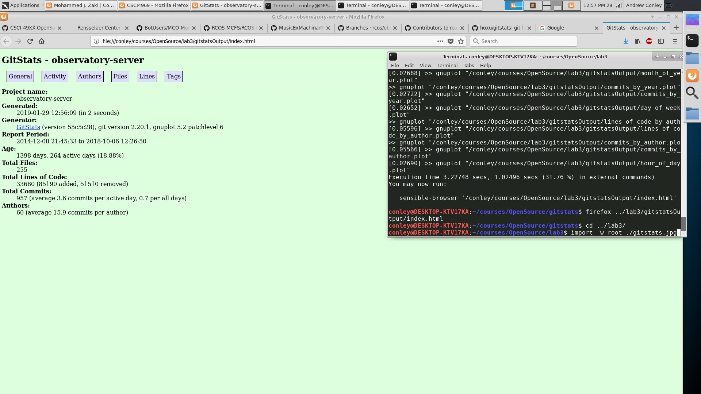
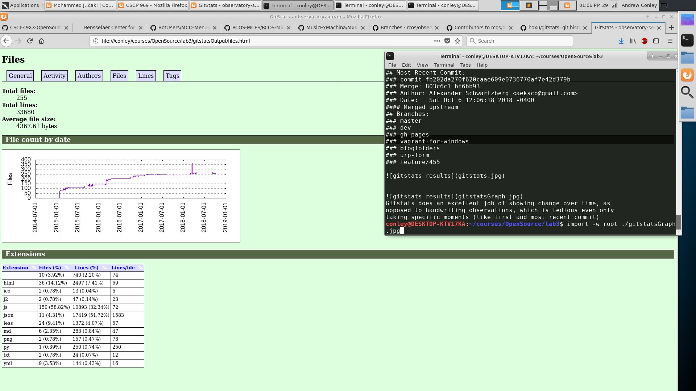

#Observatory:
## 42 contributors
## 33839 total total lines of code
## First Commit: 
### commit ac21a034bd4085bcf9b87fc44b43a558698e02cf
### Author: Aaron Gunderson <airgunde@gmail.com>
### Date:   Mon Dec 8 21:45:33 2014 -0500
#### Initial commit
## Most Recent Commit:
### commit fb202da270f620caae609e0736770af7e42d379b
### Merge: 803c6c1 bf6bb93
### Author: Alexander Schwartzberg <aeksco@gmail.com>
### Date:   Sat Oct 6 12:06:18 2018 -0400
#### Merged upstream
## Branches:
### master
### dev
### gh-pages
### vagrant-for-windows
### blogfolders
### urp-form
### feature/455

Gitstats does an excellent job of showing change over time, as
opposed to handwriting observations, which is tedious even only
taking specific moments (like first and most recent commit)
